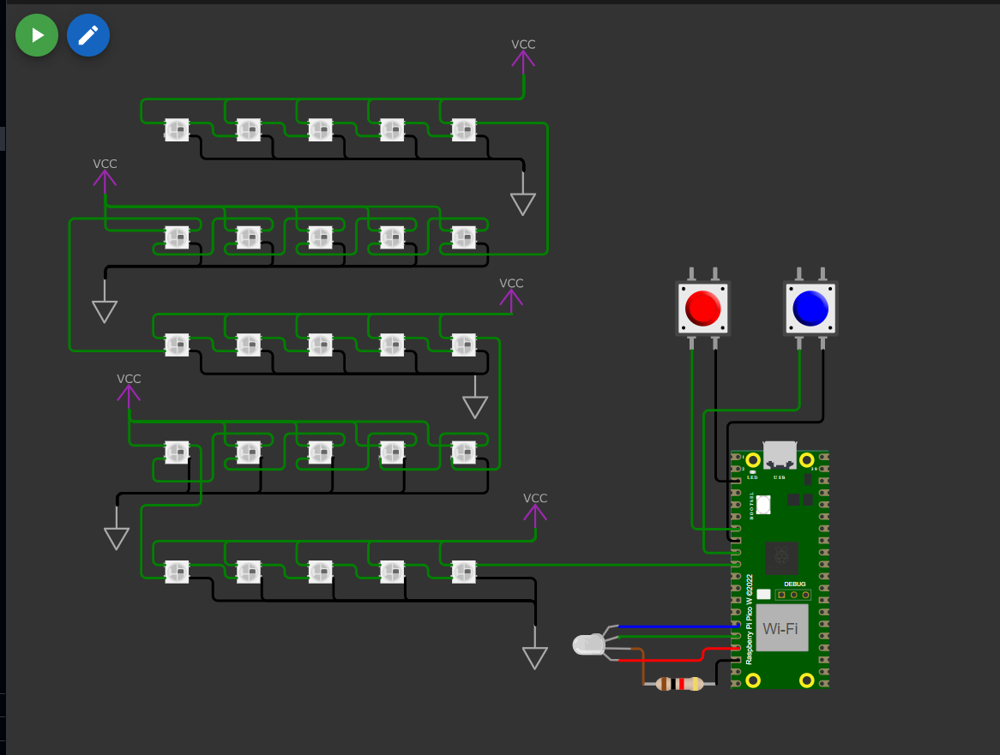
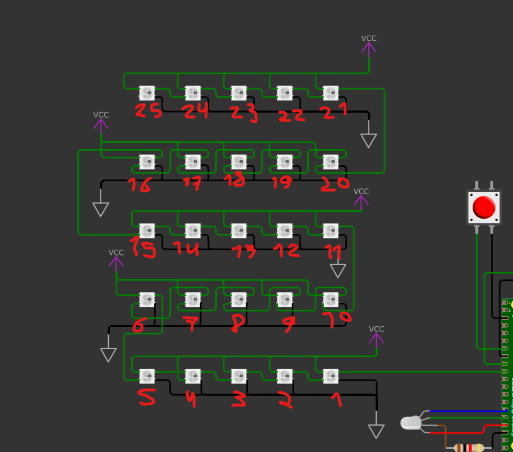

# Funcionalidade do Projeto
1. O LED vermelho do LED RGB deve piscar continuamente 5 vezes por segundo.
2. O botão A deve incrementar o número exibido na matriz de LEDs cada vez que for pressionado.
3. O botão B deve decrementar o número exibido na matriz de LEDs cada vez que for pressionado.
4. Os LEDs WS2812 devem ser usados para criar efeitos visuais representando números de 0 a 9.
    • Formatação fixa: Cada número deve ser exibido na matriz em um formato fixo, como
    caracteres em estilo digital (ex.: segmentos iluminados que formem o número).
    • Alternativamente, é permitido utilizar um estilo criativo, desde que o número seja claramente identificável.

# Requisitos do Projeto
1) Uso de interrupções: Todas as funcionalidades relacionadas aos botões devem ser implementadas utilizando rotinas de interrupção (IRQ).
2) Debouncing: É obrigatório implementar o tratamento do bouncing dos botões via software.
3) Controle de LEDs: O projeto deve incluir o uso de LEDs comuns e LEDs WS2812, demonstrando o domínio de diferentes tipos de controle.
4) Organização do código: O código deve estar bem estruturado e comentado para facilitar o entendimento.

# Modelo no Wokwi

Modelo do wowki utilizado.

Ordenação dos LEDs.

# Video de Funcionamento

<video width="600" controls>
  <source src="images/Simulacao_Bitdoglab.mp4" type="video/mp4">
  Seu navegador não suporta vídeos.
</video>

Caso não apareça o vídeo [clique aqui](images/Simulacao_Bitdoglab.mp4) para donwload.
